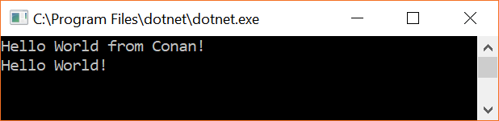
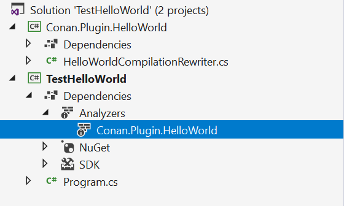

# Conan.Plugin.HelloWorld

This plugin shows how to develop a very basic HelloWorld Conan Plugin.

When used with Conan Compiler and in a project that has a main method, it will automatically insert at the beginning of the method a `Console.WriteLine(""Hello World from Conan!");`

## Usage

1. Checkout this repository
2. Open and build the solution `src\TestHelloWorld.sln`
5. Run the project `TestHelloWorld` which contains the following `Program.cs`:
   ```C#
   using System;
   
   namespace TestHelloWorld
   {
       class Program
       {
           static void Main(string[] args)
           {
               Console.WriteLine("Hello World!");
           }
       }
   }
   ```
6. You should see the following output:
   `CSC : warning HW0001: Main method successfuly modified by the HelloWorld Conan Plugin (See modified file at: ...)`
7. If you run the program, you will see the following output:   
   

## How does this work?

### Developing a CompilationRewriter

The project `Conan.Plugin.HelloWorld` is using the package `Conan.CodeAnalysis` and is providing a [`HelloWorldCompilationRewriter`](src\Conan.Plugin\HelloWorld\HelloWorldCompilationRewriter.cs) which is implementing a `CompilationRewriter` (provided by the Conan compiler)

> Note like for diagnostic analyzers, the project must be targeting `netstandard1.3`

```C#
    [DiagnosticAnalyzer(LanguageNames.CSharp)]
    public class HelloWorldCompilationRewriter : CompilationRewriter
    {
        public override Compilation Rewrite(CompilationRewriterContext context)
        {
            var compilation = context.Compilation;

            // Transform compilation
            ...

            return compilation;
        }
    }
```    

A `CompilationRewriter` inherits from `DiagnosticAnalyzer` so it will show up in your project as an analyzer (while it is a compilation rewriter):



### Using the plugin

The project `TestHelloWorld` is using the package `Conan.Net.Compilers` that allows to load the compilation rewriter plugin `Conan.Plugin.HelloWorld`, and modify the ongoing compilation.

The `Conan.Plugin.HelloWorld` is manually added to the `TestHelloWorld.csproj` project to be able to work in a local scenario:

```xml
  <ItemGroup>
      <Analyzer Include="..\Conan.Plugin.HelloWorld\bin\$(Configuration)\netstandard1.3\Conan.Plugin.HelloWorld.dll" />
  </ItemGroup>
```

In a scenario where the `Conan.Plugin.HelloWorld` would be deployed on NuGet, you would not have to use this but simply reference the plugin with Private Asset:

```xml
  <ItemGroup>
      <PackageReference Include="Conan.Plugin.HelloWorld" Version="1.0.0" PrivateAssets="all" /> 
  </ItemGroup>
```

## Licensing

This software is released under the [BSD-Clause 2 license](http://opensource.org/licenses/BSD-2-Clause). 

## Author

Alexandre MUTEL aka [xoofx](http://xoofx.com)
